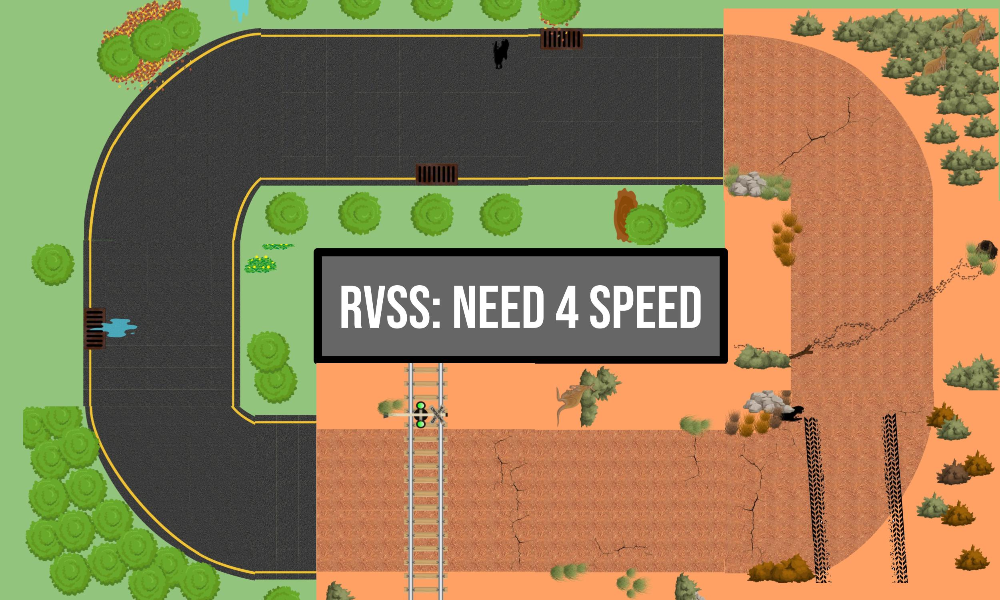

# Official Repository RVSS Workshop -- Need 4 Speed

The material provided here was developed for the workshop hosted at the [Robotic Vision Summer School](https://www.rvss.org.au/).

## Challenge Day Testing Order
To be determined

## Table of Contents
  1. [Setup your Laptop](instructions/Preparation.md)
  2. [Connect to the Robot](instructions/ControlRobot.md)
  3. [Your Task](instructions/Task.md)
  4. [Data Collection](instructions/DataCollection.md)
  5. [Build and Train a Network](instructions/NetworkTraining.md)
  6. [Create a Stop Sign Detector (optional)](instructions/StopSignDetection.md)
  7. [Deployment Time](instructions/NetworkDeployed.md)

## Acknowledgement
Thanks to Dimity Miller, Tobias Fischer, Nicolas Marticorena Vidal, Feras Dayoub, and Serena Mou for the design of the workshop and the included code (including previous iterations of the workshop).
