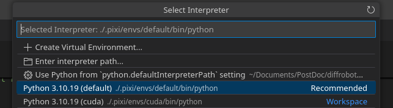

# Workshop setup - before you arrive

Please follow each of the steps below before arriving at RVSS:
- [Use pixi for package management](#use-pixi-for-package-management)
- [Clone the repository](#clone-the-repository)
- [Install workspace](#install-workspace)
- [Download the starter data](#download-the-starter-data)
- [Check installation](#check-installation)
- [Download Visual Studio Code for code development](#download-visual-studio-code-for-code-development)

# Use pixi for package management
In this workshop, we will use [pixi](https://pixi.prefix.dev/). Pixi is a package manager for Windows, Mac and Linux - it allows you to install packages similar to `apt`, `homebrew` and `vcpkg`. Pixi not only supports Python packages, but also packages in C/C++, FORTRAN, and much more.

Nothing that can be done with pixi cannot be achieved otherwise. However, with pixi it is usually easier, cross-platform and easier to reproduce.

Pixi handles dependencies seamlessly and makes it easy to set up different environments with different versions of libraries, and to reproduce environments. This repository contains a `pixi.toml` file specifying all dependencies, and a `pixi.lock` file that lists the exact version we used, so you can replicate our environment exactly.

## Guide for setting up pixi

### Linux/MacOS
To install pixi you can run the following command in your terminal:

```bash
curl -fsSL https://pixi.sh/install.sh | sh
```

### Windows
To install pixi in windows you can run the following command in the Windows Powershell:

```shell
powershell -ExecutionPolicy Bypass -c "irm -useb https://pixi.sh/install.ps1 | iex"
```

# Clone the repository
Before you attend the workshop, you will need a copy of this repository on your personal laptop. Clone the repository into your chosen folder on your personal laptop with this terminal command:

`git clone --recursive https://github.com/rvss-australia/RVSS_Need4Speed.git`

*If git its not installed in your system you can install it using pixi as `pixi global install git`*

# Install workspace
Pixi's biggest strength is its ability to create reproducible, powerful, and flexible workspaces. A workspace lives in a directory on your system, and is a collection of Pixi environments that can be used to develop one or many projects in that directory. The dependencies and enviroments are defined in a [manifest file](../pixi.toml).

In order to install the dependencies you need to run the following command in the cloned `RVSS_Need4Speed` directory.

```bash
cd RVSS_Need4Speed  # if using the same terminal where the code was cloned
# Install the default environment in your computer (CPU only)
pixi install
# Install GPU dependencies. This will work for CUDA machines, on both Linux and Windows
pixi install -e cuda  
```

*On Windows, some libraries do not fully support Unicode paths. If the file path contains non-ASCII characters (e.g., Chinese or Japanese), errors may occur. In this case, clone the repository into a directory directly under `C:\`*

*In Windows you may need to enable [long path lengths](https://learn.microsoft.com/en-us/windows/win32/fileio/maximum-file-path-limitation?tabs=powershell#application-manifest-updates-to-declare-long-path-capability) if you get an error when creating the environment.*

## Working with the environment:
You can activate an environment in pixi by running `pixi shell` or `pixi shell -e cuda` if an NVIDIA gpu is available.

*In windows you may need to run the command as `powershell -ExecutionPolicy Bypass -c "pixi shell" ` if running scripts are disabled in the system*

# Download the starter data
You can download the starter data through a pixi task. To do so, please run the following:
```bash
pixi run get_dataset
```

This will download the dataset available in [huggingface](https://huggingface.co/datasets/dimitym/RVSS_Need4Speed_starter/tree/main) and unzip it inside your cloned repository.

You should have a `data` folder that contains a `train_starter` and `val_starter` folder, containing 793 and 436 images respectively.


# Check installation

After the installation is done, you can check your installation by running `pixi run test` or alternatively `pixi run -e cuda test` to check if the GPU is supported.


# Download Visual Studio Code for code development
We strongly recommend downloading Visual Studio Code to use as your code editor during the workshop. You can download VS Code [here]( https://code.visualstudio.com/). Please install at least the following two extensions: Python and Remote - SSH.


If using VSCode, remember to select the Python interpreter as the one inside the `.pixi` local folder (this should happen automatically)


